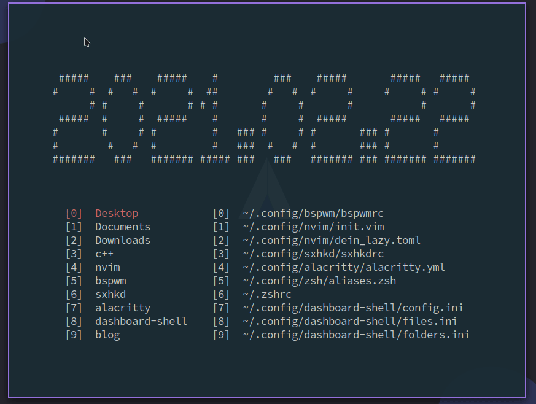

# dashboard-shell

## 依赖

- `figlet`
    + `Arch: sudo pacman -S figlet`
    + `Mac: brew install figlet`
    + `ubuntu: sudo apt-get install figlet`

你不一定按照我说的去安装，`figlet`的安装方式有很多种

## 安装

```bash
$ git clone https://github.com/demonlord1997/dashboard-shell
$ cd dashboard-shell
$ ./build.sh
```
在`.zhsrc` / `.bashrc`中添加
```bash
alias ds='. $HOME/.config/dashboard-shell/dashboard-shell-run.sh'
alias q="source $HOME/.config/dashboard-shell/add-recent-path.sh && exit"
```
然后`source ~/.zshrc` / `source ~/.bashrc`


## 展示

当你的terminal空间较大时，会在上方显示一个日期


当你的terminal空间较小时，则不显示日期，但会给你的两个子窗口添加边框


你可以使用`dashboard-shell`来打开目录或者选择编辑文件，你可以运行`shell`命令，打开软件等等



当你输入q退出终端时，会更新你最近打开的文件夹


## 快捷键
| key                               | function                                                                      |
|-----------------------------------|-------------------------------------------------------------------------------|
| `q`/`Q`                           | 退出 dashboard-shell                                                          |
| `esc`                             | 退出当前窗口：如果有输入框，退出输入框； 如果没有输入框，退出 dashboard-shell |
| `0-9`                             | 选择当前窗口下的选项0-9                                                       |
| `j`/ &darr;                       | 光标向下移动                                                                  |
| `k`/ &uarr;                       | 光标向上移动                                                                  |
| `l`/ &rarr;                       | 到右边的窗口                                                                  |
| `h`/ &larr;                       | 到左边的窗口                                                                  |
| `g`                               | 跳转到当前窗口的第一个选项                                                    |
| `G`                               | 跳转到当前窗口的最后一个选项                                                  |
| `tab`                             | 切换窗口                                                                      |
| `o`                               | 打开输入框                                                                    |
| `e`                               | 打开编辑器                                                                    |
| `r`                               | 打开最近打开过的文件夹                                                        |
| `qwe ... p`(`qwerty`键盘的第一行) | 选择当前窗口（最近文件夹窗口）下的选项10-19                                   |

## 配置
配置文件在`~/.config/dashboard-shell`目录下的`config.ini`文件中。
`config.ini`的示例文件如下：

```ini
[editor]
name=nvim

[folders]
name = \
       ~/Desktop,\
       ~/Documents,\
       ~/Downloads,\
       ~/Desktop/c++,\
       ~/.config/nvim,\
       ~/.config/bspwm,\
       ~/.config/sxhkd,\
       ~/.config/alacritty,\
       ~/.config/dashboard-shell,\
       ~/Desktop/blog

[files]
name = \
      ~/.config/bspwm/bspwmrc,\
      ~/.config/nvim/init.vim,\
      ~/.config/nvim/dein_lazy.toml,\
      ~/.config/sxhkd/sxhkdrc,\
      ~/.config/alacritty/alacritty.yml,\
      ~/.config/zsh/aliases.zsh,\
      ~/.zshrc,\
      ~/.config/dashboard-shell/config.ini,\
      ~/.config/dashboard-shell/files.ini,\
      ~/.config/dashboard-shell/folders.ini
```

- `editor`：
可以设置打开文件的编辑器
- `folders`：
设置要展示文件夹
- `files`：
设置要展示文件

## TODO
- 显示最近编辑的文件
