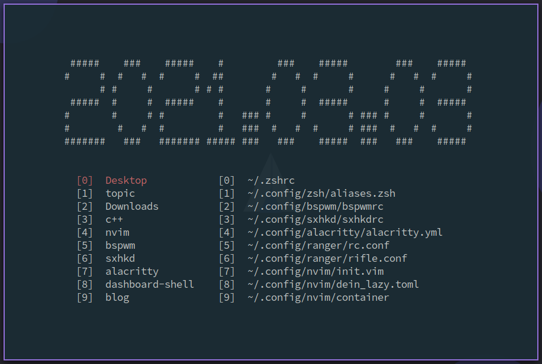

# dashboard-shell

## 依赖

- figlet

## 展示



## 安装
```bash
git clone https://github.com/demonlord1997/dashboard-shell
cd dashboard-shell
./build.sh
```
在`.zhsrc` / `.bashrc`中添加
```bash
alias ds='. $HOME/.config/dashboard-shell/dashboard-shell-run.sh'
```

## 快捷键
| key     | function                                                        |
|---------|-----------------------------------------------------------------|
| `q`/`Q` | 退出 dashboard-shell                                            |
| `esc`   | 如果有输入框，退出输入框； 如果没有输入框，退出 dashboard-shell |
| `0-9`   | 选择当前窗口下的选项                                            |
| `j`/`k` | 光标下/上                                                       |
| `h`/`l` | 到左边/右边的窗口                                               |
| `tab`   | 切换窗口                                                        |
| `o`     | 打开输入框                                                      |

## 配置
配置文件在`~/.config/dashboard-shell`目录下。

- config：
可以设置打开文件的编辑器

- folders.ini：
展示文件夹

- files.ini：
展示文件


