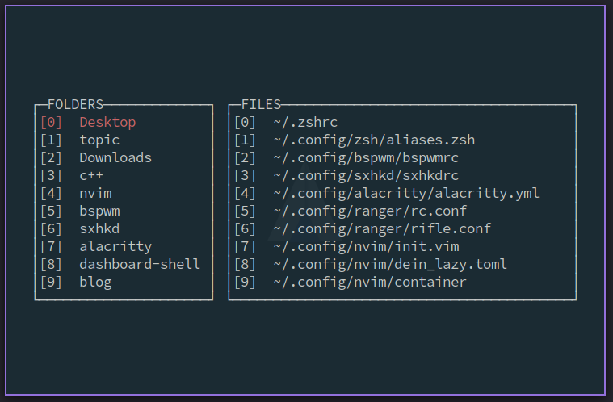

# dashboard-shell
<!-- vim-markdown-toc Marked -->

* [依赖](#依赖)
* [安装](#安装)
* [展示](#展示)
    * [打开历史文件](#打开历史文件)
* [快捷键](#快捷键)
* [配置](#配置)

<!-- vim-markdown-toc -->

## 依赖

- `figlet`
    + `Arch: sudo pacman -S figlet`
    + `Mac: brew install figlet`
    + `ubuntu: sudo apt-get install figlet`

你不一定按照我说的去安装，`figlet`的安装方式有很多种

## 安装

```bash
$ git clone https://github.com/demonlord1997/dashboard-shell
$ cd dashboard-shell
$ ./build.sh
```

在终端输入ds即可打开dashboard-shell。


如果你用zsh，你在终端输入q即可更新最近打开的目录并退出终端，当你下一次打开dashboard-shell时，按下r即可看到你最近去过的目录。

**注意与zsh中d命令的区别：** 与zsh中的d命令不同，当你打开一个新终端的时候，d命令显示你最近去过的目录为空，因为它无法读取你上一次退出终端之前的信息，它仅在当前终端有效。


## 展示
（--- 录屏有卡顿 ---）

你可以输入ds来打开`dashboard-shell`，当你的terminal空间较大时，会在上方显示一个日期；当你的terminal空间较小时，则不显示日期，但会给你的两个子窗口添加边框

| dashboard-shell-full                     | dashboard-shell-mini                     |
|------------------------------------------|------------------------------------------|
|  |  |


你可以按下r来显示最近打开的目录，输入q退出终端，再次打开dashboard-shell，则会看到你之前去过的目录


| 展示功能                   | 图片                                                                                                                    |
|----------------------------|-------------------------------------------------------------------------------------------------------------------------|
| 打开最近目录               | <details><summary><font color="green">点击显示图片</font></summary></details> |
| 打开最近目录、更新最近目录 | <details><summary><font color="blue">点击显示动图</font></summary></details>    |


你可以在`config.ini`中自定义一些软件或命令的快捷键，例如`ctrl-r`打开`ranger`，`n`输出系统信息等。

| 展示功能     | 图片                                                                                                            |
|--------------|-----------------------------------------------------------------------------------------------------------------|
| 自定义快捷键 | <details><summary><font color="blue">点击显示动图</font></summary></details> |

你也可以按下`o`输入你想要执行的命令
| 展示功能     | 图片                                                                                                          |
|--------------|---------------------------------------------------------------------------------------------------------------|
| 输入执行命令 | <details><summary><font color="blue">点击显示动图</font></summary></details> |

### 打开历史文件

你也可以打开历史文件（我用neovim，下面是`dashboard-shell`通过neovim打开历史文件的操作，vim同neovim一样）

1. 首先你的neovim要能够打开历史文件，因为我平时在使用`fzf`这个插件，所以我可以通过在neovim中输入`:History`来打开历史文件。如果你用其他的插件比如`LeaderF`之类的，你记住相应的命令就可以了。

2. 在`dashboard-shell`的配置文件`config.ini`中添加自定义快捷键：
```ini
[customize]
nvim -c 'History' = e
```
因为我打开历史文件的命令是History，所以我在neovim启动的时候运行History命令，你可以改成你所使用插件对应的命令。现在我按下e就会打开历史文件。


## 快捷键
| key         | function                                                                         |
|-------------|----------------------------------------------------------------------------------|
| `Q`         | 退出 dashboard-shell                                                             |
| `q`         | 如果不处于RECENT FOLDER窗口中，则退出 dashboard-shell，否则，选择当前窗口的q选项 |
| `esc`       | 退出当前窗口：如果有输入框，退出输入框； 如果没有输入框，退出 dashboard-shell    |
| `j`/ &darr; | 光标向下移动                                                                     |
| `k`/ &uarr; | 光标向上移动                                                                     |
| `l`/ &rarr; | 到右边的窗口                                                                     |
| `h`/ &larr; | 到左边的窗口                                                                     |
| `g`         | 跳转到当前窗口的第一个选项                                                       |
| `G`         | 跳转到当前窗口的最后一个选项                                                     |
| `tab`       | 切换窗口                                                                         |
| `o`         | 打开输入框                                                                       |
| `r`         | 打开最近打开过的文件夹                                                           |

按下选项前的数字或字母可以选择当前窗口下对应的选项。

## 配置
配置文件在`~/.config/dashboard-shell`目录下的`config.ini`文件中。
`config.ini`的示例文件如下：

```ini
[editor]
name=nvim

[folders]
name = \
    ~/Desktop,\
    ~/Documents/topic,\
    ~/Downloads,\
    ~/Desktop/c++,\
    ~/.config/nvim,\
    ~/.config/bspwm,\
    ~/.config/sxhkd,\
    ~/.config/alacritty,\
    ~/.config/dashboard-shell,\
    ~/Desktop/blog

[files]
name = \
    ~/.zshrc,\
    ~/.config/zsh/aliases.zsh,\
    ~/.config/bspwm/bspwmrc,\
    ~/.config/sxhkd/sxhkdrc,\
    ~/.config/alacritty/alacritty.yml,\
    ~/.config/ranger/rc.conf,\
    ~/.config/ranger/rifle.conf,\
    ~/.config/nvim/init.vim,\
    ~/.config/nvim/dein_lazy.toml,\
    ~/.config/nvim/container

[sh]
run = ~/.config/dashboard-shell/dashboard-shell-run.sh
rp = ~/.config/dashboard-shell/add-recent-path.sh

[customize]
nvim -c 'History' = e
lazygit = <C-l>
ranger = R
neofetch = n
nvim ~/.config/dashboard-shell/config.ini = <C-c>
```

- `editor`：
可以设置打开文件的编辑器
- `folders`：
设置要展示文件夹
- `files`：
设置要展示文件
- `customize`
设置要运行的软件或命令的快捷键
- `sh`
其实没有用，只是为了方便你跳转到`dashboard-shell-run.sh`和`add-recent-path.sh`这两个文件而添加的

